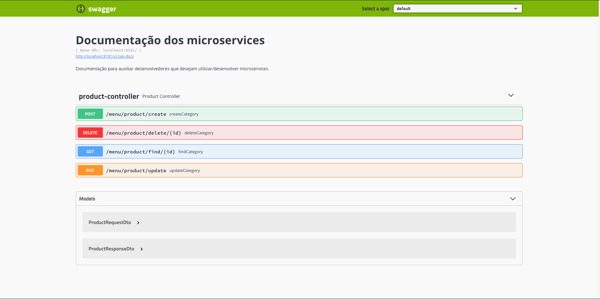
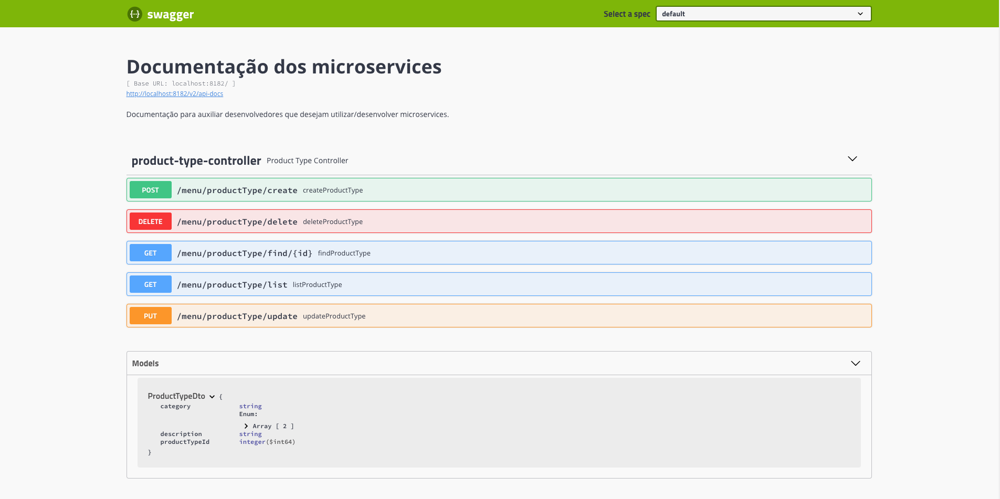

# Menu
RESTful API for managing menu

* To compile the project, you should go to the main Class ```MenuMicroService<MicroServiceName>Application.java``` 
and run the project.
* The Menu MicroService it's a Maven project, so you should download it. To build the project, run the command:
```mvn install```. If everything is ok, you will be able to see a ```BUILD SUCCESS``` message on your screen.

## Run docker

* Clone the project.
* In root project, run:

```
    $ ./start.sh
 ```
 
 ## Api Consumer
 
 * To consumer Menu Api, navigate for swagger pages.
 
 Run:
 
 ```
 $ docker compose up
 
 ```
 
    1. Menu-microservice-product
 
 Link:  http://localhost:8180/swagger-ui.html
 
 
 
    2. Menu-microservice-product-type
 
 Link:  http://localhost:8080/swagger-ui.html
 
 